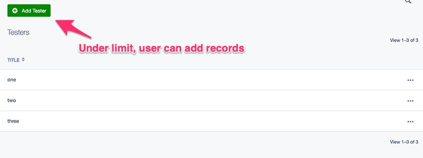

# silverstripe-gridfield-limiter

Small module to limit number of records that can be added to a SilverStripe GridField.

Important - this module does not prevent records being added at an ORM/code-level in any way.

Instead, it manipulates the `GridField` UI to allow developers to hide controls like `GridFieldAddNewButton` once a set limit is reached, preventing CMS users from adding more records via that grid field.

* It hides `GridFieldAddNewButton`, `GridFieldAddExistingAutocompleter` and other `GridFieldComponent`s you define, if the limit is reached
* Optionally, if limit has been reached, a message is also presented to the user notifying them of this 

## Requirements

SilverStripe 4.2+

## Installation

`composer require fromholdio/silverstripe-gridfield-limiter`

## Detail

* Add `GridFieldLimiter` to your `GridFieldConfig`, and define a target fragment (defaults to `before`) 
* It will create two new target fragments, `limiter-before-left` and `limiter-before-right` (`before` comes from the defined target fragment)
* You can now fill these two fragments with grid field components, like a `GridFieldAddNewButton` on the left and a `GridFieldAddExistingAutocompleter` on the right, which will all be hidden (via css) from the CMS user once the grid field reaches its row limit
* If enabled, a message will be displayed to the user telling them to remove an item before they add a new one

Per the note above, this does not in anyway validate the number of objects in a relationship or prevent an object being added - it's just a cheeky way to implement a limit for CMS users managing a grid field.

### Under-limit screenshot



### Limit-reached screenshot


## Usage example

We have a standard `GridField` using a `GridFieldConfig_RecordEditor` and will add a limit to it.

```php
$gridField = GridField::create(
    'Widgets',
    'Widgets',
    $this->Widgets(),
    $gridConfig = GridFieldConfig_RecordEditor::create()
);
```

Remove the `GridFieldAddNewButton` in preparation to add one within our `GridFieldLimiter`:

```php
$gridConfig->removeComponentsByType(GridFieldAddNewButton::class);
```

Add the `GridFieldLimiter`

```php
$limit = 4;  // We want to limit this gridfield to 4 objects
$targetFragment = 'before' // Set gridfield target fragment value
$showLimitReachedMessage = true // We want to show the user a note when the limit is reached

$gridConfig->addComponent(
    new GridFieldLimiter($limit, $targetFragment, $showLimitReachedMessage)
);
```

Add a `GridFieldAddNewButton` (and/or any other components) you would like displayed while under limit but hidden when limit is reached, using the `limiter` target fragment.

```php
$gridConfig->addComponent(
    new GridFieldAddNewButton('limiter-before-left')
);
```

That should work!

```php
$fields->addFieldToTab('Root.Testing', $gridField);
```
